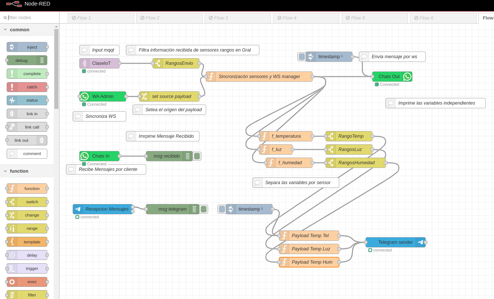

# Descripción del Proyecto

Este proyecto configura un sistema de automatización y comunicación utilizando varias tecnologías. La infraestructura incluye Node-RED, Docker, Mosquitto (Eclipse), WhatsApp y un bot de Telegram. El objetivo es crear una solución integrada que permita el control y la monitorización de dispositivos simulando sensores mediante un script de python, así como la comunicación a través de múltiples canales.

  

## Tecnologías Utilizadas

### 1. Node-RED

Node-RED es una herramienta de programación basada en flujos para conectar dispositivos, APIs y servicios en línea de manera visual. Permite crear aplicaciones mediante la programación gráfica y simplifica la integración de diferentes servicios.

### 2. Docker

Docker es una plataforma para desarrollar, enviar y ejecutar aplicaciones en contenedores. En este proyecto, Docker se utiliza para contener y gestionar las instancias de Node-RED, Mosquitto y otros servicios, proporcionando un entorno aislado y consistente para cada componente.

### 3. Mosquitto (Eclipse)

Mosquitto es un broker MQTT (Message Queuing Telemetry Transport) ligero y de código abierto. Se utiliza para la transmisión de mensajes en tiempo real entre dispositivos y aplicaciones. MQTT es ideal para aplicaciones IoT (Internet de las cosas) debido a su eficiencia y bajo consumo de ancho de banda.

### 4. WhatsApp

WhatsApp es una aplicación de mensajería que permite enviar mensajes de texto, voz y multimedia. En este proyecto, se utilizará para recibir y enviar mensajes relacionados con eventos y notificaciones del sistema.

### 5. Bot de Telegram

Un bot de Telegram es un programa que interactúa con los usuarios a través de la plataforma de mensajería Telegram. Este bot se utilizará para enviar notificaciones y recibir comandos para controlar el sistema.

## Flujo del Proyecto

1. **Configuración de Docker**: Se crean contenedores Docker para Node-RED y Mosquitto. Docker proporciona un entorno controlado y replicable para estos servicios.

2. **Configuración de Node-RED**: Node-RED se utiliza para diseñar flujos que integran Mosquitto y otros servicios. Los flujos pueden incluir lógica para enviar y recibir mensajes, interactuar con APIs y procesar datos.

3. **Configuración de Mosquitto**: Mosquitto actúa como el broker MQTT, gestionando la comunicación entre diferentes componentes del sistema a través de mensajes MQTT.

4. **Integración con WhatsApp**: Se configura una interfaz para enviar y recibir mensajes de WhatsApp, permitiendo que el sistema envíe notificaciones y reciba comandos a través de la aplicación de mensajería.

5. **Desarrollo del Bot de Telegram**: Se desarrolla y configura un bot de Telegram para interactuar con el sistema. El bot puede enviar actualizaciones y recibir comandos para controlar el flujo de datos.

6. **Interacción y Automatización**: Los usuarios pueden interactuar con el sistema a través de WhatsApp y Telegram. Node-RED gestiona la lógica y la comunicación entre los diferentes servicios, procesando los mensajes y ejecutando acciones en función de las solicitudes de los usuarios.

## Objetivos

- **Automatización**: Automatizar procesos y tareas mediante la integración de Node-RED con MQTT y servicios de mensajería.
- **Comunicación Multicanal**: Facilitar la comunicación a través de WhatsApp y Telegram, proporcionando a los usuarios múltiples formas de interactuar con el sistema.
- **Monitoreo y Control**: Permitir el monitoreo y control de dispositivos a través de una interfaz gráfica en Node-RED y comandos de mensajería.

## Requisitos

- Docker instalado en el entorno de desarrollo.
- Conocimientos básicos de Node-RED, MQTT y las API de WhatsApp y Telegram.
- Cuentas y configuraciones necesarias para interactuar con WhatsApp y Telegram.

Este proyecto proporciona una solución completa para la integración y automatización utilizando herramientas modernas y tecnologías ampliamente adoptadas.

# Pasos para Configurar la Imagen de Mosquitto

# 1. Descargar la Imagen de Mosquitto
	docker pull eclipse-mosquitto

# 2. Crear un Contenedor a Partir de la Imagen Descargada
	docker run -d --name mosquitto_agosto -p 1883:1883 -p 9001:9001 eclipse-mosquitto

# 3. Iniciar el Contenedor
	docker start mosquitto_agosto

# 4. Instalar `vim` en el Contenedor
	docker exec -it mosquitto_agosto apk add vim

# 5. Editar el Archivo `mosquitto.conf`
# Descomentar las líneas `allow_anonymous` y `listener` en el archivo de configuración
	docker exec -it mosquitto_agosto /bin/sh -c "cd /mosquitto/config && vim mosquitto.conf"

# Instrucciones para Editar `mosquitto.conf`
------------------------------------------------------------------
General configuration : Descomentar la línea `allow_anonymous` 
allow_anonymous true

------------------------------------------------------------------
Listeners: Descomentar la línea `listener` 
listener 1883 0.0.0.0

# Para editar el archivo con `vim`:
1. Buscar una línea presionando `Esc` seguido de `/` y el texto a buscar.
2. Presionar `Enter` para ir a la línea encontrada y descomentarla.
3. Guardar los cambios con `:w`.
4. Salir del editor con `:qa`.

  

# 6. Reiniciar el Contenedor
	docker restart mosquitto_agosto
        docker exec -it mi_contenedor /bin/sh  //modo terminal ppara interactuar en la instancia del contededor

# Crear una imagen a partir del contenedor
	docker commit mi_contenedor mi_imagen_personalizada:v1
# Puedes personalizar la imagen
	docker tag mi_imagen_personalizada:v1 usuario_dockerhub/mi_imagen_personalizada:v1

# Incias Sesion con tu cuenta de Docker
	Docker login
	docker push usuario_dockerhub/mi_imagen_personalizada:v1
# Verifica la imagen subida 
	docker search usuario_dockerhub/mi_imagen_personalizada

nota: con estos pasos tienes una imágen a partir de tu contenedor previamente configurado de manera local y con el editor de textos VIM.
